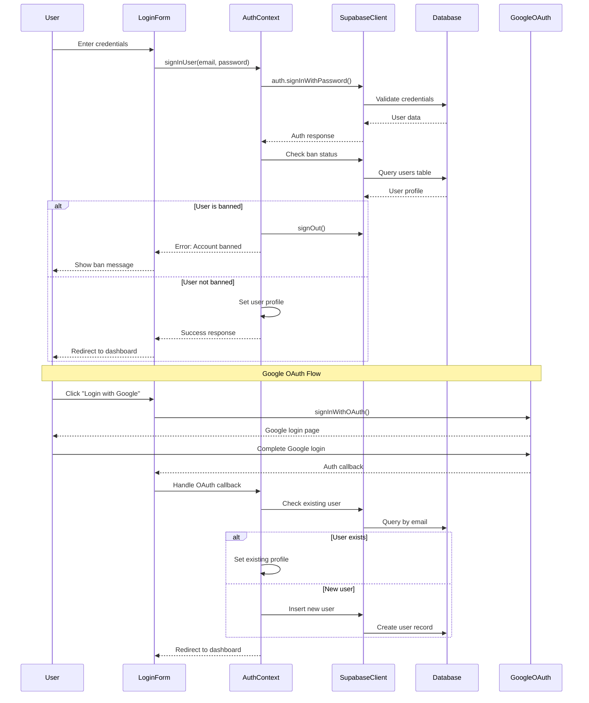
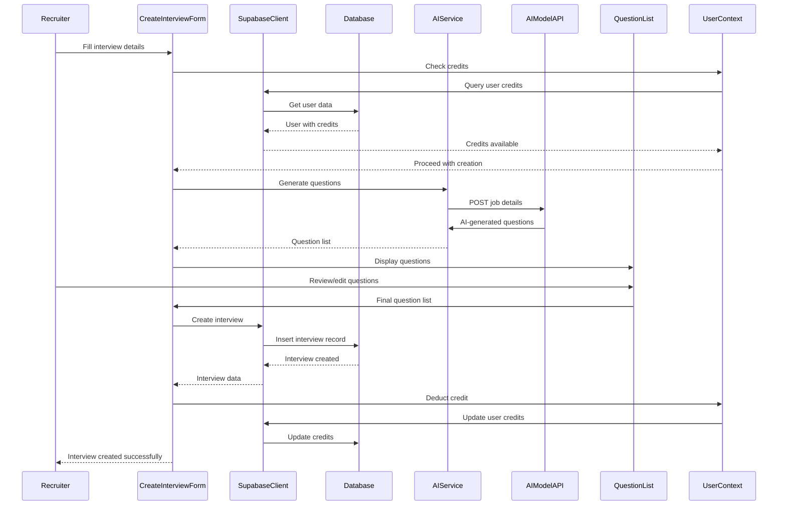
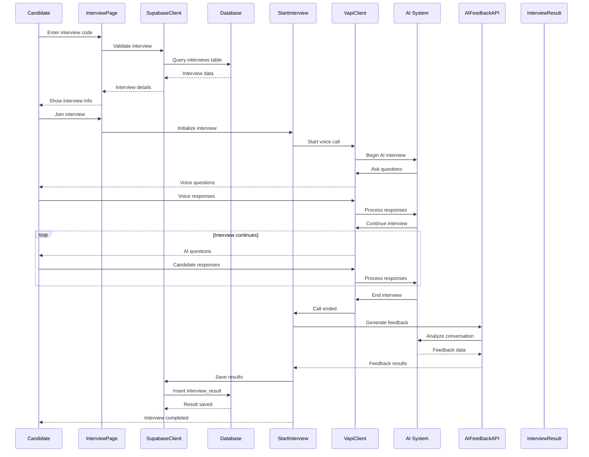
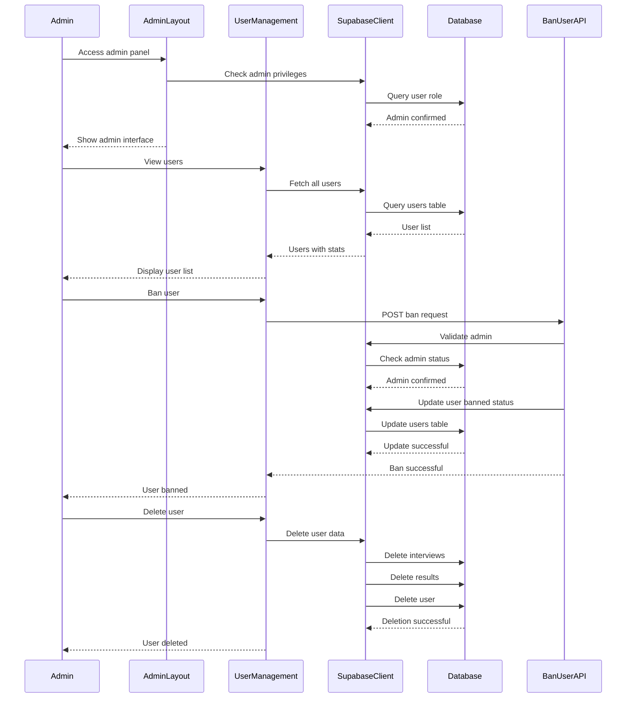
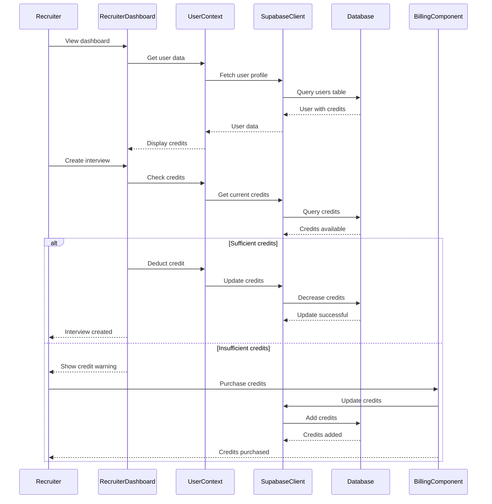

# Sequence Diagram - AI Interview Platform

## 1. User Registration and Authentication Flow

## 2. Interview Creation Flow

## 3. Interview Participation Flow

## 4. Admin User Management Flow

## 5. Credit System Flow

## Key Interactions Explained:

### 1. Authentication Flow
- **Email/Password**: Traditional authentication with ban checks
- **Google OAuth**: Social login with automatic user creation
- **Ban System**: Prevents banned users from accessing the platform

### 2. Interview Creation
- **Credit Check**: Ensures recruiter has sufficient credits
- **AI Question Generation**: Uses AI to create relevant questions
- **Database Storage**: Saves interview configuration
- **Credit Deduction**: Reduces recruiter credits after creation

### 3. Interview Participation
- **Code Validation**: Verifies interview code exists
- **Voice AI Integration**: Real-time voice conversation
- **Feedback Generation**: AI analyzes responses and provides feedback
- **Result Storage**: Saves interview results for review

### 4. Admin Management
- **Privilege Validation**: Ensures admin access
- **User Operations**: Ban/unban/delete users
- **Data Management**: Comprehensive user and interview management

### 5. Credit System
- **Credit Tracking**: Monitors recruiter credits
- **Purchase Flow**: Allows credit purchases
- **Usage Control**: Prevents interview creation without credits

## System Integration Points:
- **Supabase**: Central database and authentication
- **Vapi AI**: Voice interview technology
- **OpenAI**: Question generation and feedback analysis
- **Google OAuth**: Social authentication
- **File Storage**: CV uploads and profile pictures 